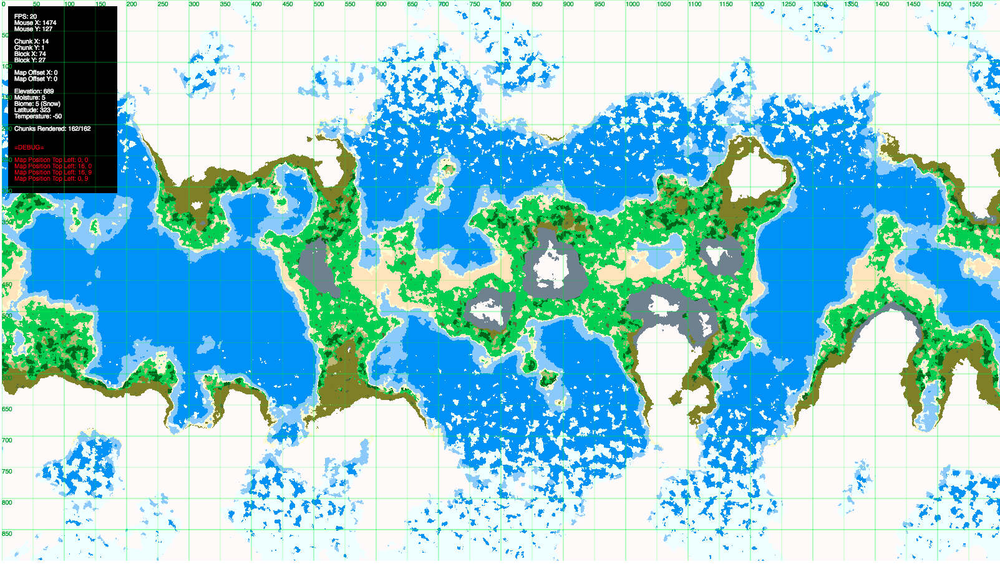

# TerrainSimulator

Small world generation sandbox derived from the work by [Amit Patel (Red Blob Games)](https://www.redblobgames.com/maps/terrain-from-noise/).
Thank you for making your work available so that others can learn.

Check out a demo [here!](https://sammills.gitlab.io/TerrainSimulator/)

### Description

This is a simple world generator sandbox built in Javascript using [Simplex noise](https://www.npmjs.com/package/simplex-noise).
I intend to use this for real time simulation of settlement placement and road/pathways with the use of AI, but this
project is intended to be modular and re-useable in future.

Preview:

